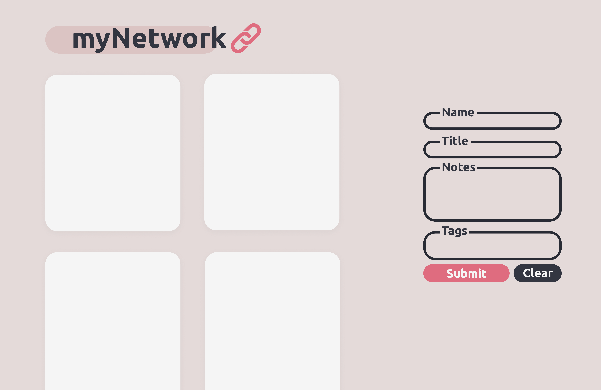

# myNetwork
 
Learning about full-stack web development through developing an application using the MERN stack (JavaScript, Node.js, React.js, Express.js, and MongoDB), intended for students to manage the connections that they make at an internship

